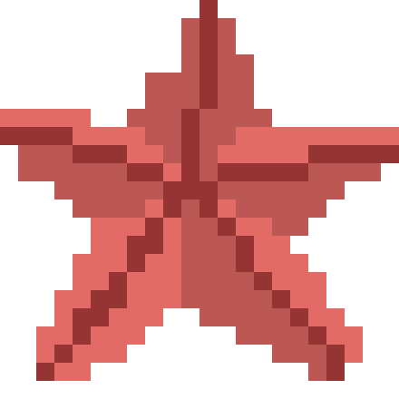
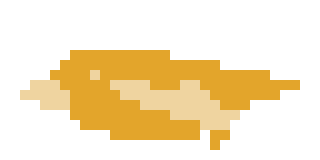

<h3 align="center" >
  
   
  
    
  
   
  <strong style="font-size:1.17em">Starfish</strong>
   
  <code style="font-size:1em">beta-0.4.0</code>
   
  <h6 align="center" style="margin-top:0; margin-bottom:0">
    by <a href="https://nickesc.github.io">N. Escobar</a> / <a href="https://github.com/nickesc">nickesc</a>
  </h6>
  <h6 align="center" style="padding-top:5px; margin-top:0; margin-bottom:2em">
    a small, physics-based game with a simple premise: throw the Starfish as far as you can before the timer runs out!
  </h6>
  
</h3>

 

  

### How to play

*Starfish* is a small, physics-based game with a simple premise: throw the starfish as far as you can before the timer runs out.

Click-and-drag on the game to select the power and angle, then release to throw! On-screen controls or `WASD`/`arrow keys` allow you to apply a small force in either direction to the starfish while it's in the air.

In the current `beta` versions, you start by being able to throw the starfish up to 3 times, and if the time limit is reached the starfish will fall out of the sky and into the ocean. If the starfish hits an obstacle, it will also bounce around, so watch out for birds, boats, planes and maybe even visitors from another world! There are also special boost spots that will take the starfish up higher!

Try and collect as many shells as you can! They can be used to purchase upgrades after your throw, to do things like increase your time limit, increase your maximum throw power, and increase your number of throws.

 

  

### About

The game is loosely based on the starfish story:

> One day, an old man was walking along the beach when he saw a child bend down, pick up a starfish and throw it into the sea. 
> 
> The old man asks the child, "what are you doing?" The child responds, gesturing down to the starfish covered beach, "throwing them back in the water. The tide is going out. If I don't throw them back, they'll die."
>
> The old man shakes his head, and says "it's pointless, there are hundreds of starfish on the beach, you won't make a difference."
>
> The child bends down and picks up another starfish. "Maybe," they say, throwing in the starfish.
>
> #### "But to that one, it made all the difference in the world."

In the final game, the idea is you play as the old man, trying out the child's point-of-view and throwing in as many starfish as he can.

*Starfish* is currently in active development as an entry in the [__Gamedev.js Jam 2023__](https://itch.io/jam/gamedevjs-2023) game jam. Entries are required to be playable in the browser, so it has been designed from the ground up to be playable both on desktop and on mobile. The game is also being submitted to be judged in the Open-Source category.

*Starfish* is built with [Godot](https://godotengine.org/).

### Download

*Starfish* can either be downloaded as a native MacOS app, or it can be downloaded as an HTML page and run on a `localhost` with the included Python script.

Directions for download and install are available on the [__Releases__](https://github.com/nickesc/projectStarfish/releases) page, as well as previous versions.

The game is also playable in, and primarily developed for, the browser, at [`https://nickesc.github.io/projectStarfish`](https://nickesc.github.io/projectStarfish), which hosts the active development build.

### Attributions

Music by [Dream-Protocol](https://pixabay.com/users/dream-protocol-9556087) from [Pixabay](https://pixabay.com/music)

Title Music - [*Tuneful Chips - Classic Arcade Game*](https://pixabay.com/music/video-games-tuneful-chips-classic-arcade-game-116829/) by [Dream-Protocol](https://pixabay.com/users/dream-protocol-9556087)
Game Music - [*Garbage File - Classic Arcade Game*](https://pixabay.com/music/video-games-garbage-file-classic-arcade-game-116811/)

### License

*Starfish* is released by N. Escobar Media under the MIT License. For more information, see [`LICENSE`](license).

 

     

 
